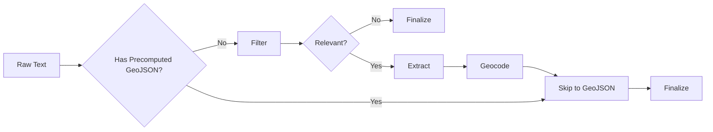

# Agent Development Guidelines

This document outlines critical patterns, standards, and workflows for AI agents working on the `oborishte-map` codebase. **Strict adherence is required.**

## 1. Core Principles & Workflow

### DRY & Shared Utilities

**Strictly enforce DRY (Don't Repeat Yourself).**

- **Check before implementing:** Always search `web/lib/` and `ingest/lib/` for existing utilities.
- **Extract duplicates:** If code is used in ≥2 files, extract it.
  - **Module scope:** Used in ≥2 files in one module → `module/utils.ts`
  - **Global scope:** Used in ≥2 modules → `ingest/lib/` or `web/lib/`
- **Naming:** Use named exports.

### Developer Preference Enforcement

If you identify a recurring pattern or developer preference:

1. **Apply immediate fix.**
2. **Suggest automation** (ESLint, Prettier, etc.).
3. **Propose AGENTS.md update** if it's a general project standard (affects 10+ files or architecture).

### Required Implementation Steps

**Every implementation plan must end with:**

1. **DRY Extraction:** Identify and extract duplicate patterns.
2. **Unit Tests:** Write Vitest tests for all functional units (parsers, transformers).
3. **Validation:** Run `npm run test:run` and fix failures.
4. **Documentation:** Update `README.md` and `AGENTS.md` as needed.

---

## 2. Technical Standards

### Firebase Admin & Environment Variables

**CRITICAL:** `dotenv` must load _before_ Firebase Admin initializes.

- **Rule:** Always use **dynamic imports** for `@/lib/firebase-admin` inside your main function.
- **Pattern:**

  ```typescript
  import dotenv from "dotenv";
  import { resolve } from "node:path";

  dotenv.config({ path: resolve(process.cwd(), ".env.local") });

  async function main() {
    const { adminDb } = await import("@/lib/firebase-admin"); // Dynamic import
    // ...
  }
  ```

### GeoJSON

- **Types:** Use `GeoJSONFeatureCollection` from `@/lib/types` (NOT `geojson` npm package).
- **Coordinates:** **[longitude, latitude]** order.
- **Validation:** Always use `validateAndFixGeoJSON` from `ingest/crawlers/shared/geojson-validation.ts`.
  - Handles coordinate swapping (lat/lng fix).
  - Wraps raw arrays in `FeatureCollection`.
- **Pattern:**
  ```typescript
  const validation = validateAndFixGeoJSON(rawJson, "source-name");
  if (!validation.isValid) return; // Log errors
  const cleanGeoJson = validation.geoJson;
  ```

### TypeScript

- **Strict Mode:** No implicit `any`.
- **Imports:** Prefer named exports.

---

## 3. Domain Guidelines

### Message Ingestion Pipeline

The pipeline processes messages about public infrastructure disruptions in Sofia, Bulgaria.

**Two-Stage LLM Processing:**

1. **Filtering Stage** (`ingest/prompts/message-filter.md`)

   - Determines if message contains public infrastructure information
   - Removes transport-only content (bus routes, metro schedules, tram timetables)
   - Returns `{isRelevant: boolean, normalizedText: string}`
   - Irrelevant messages are finalized immediately without geocoding

2. **Extraction Stage** (`ingest/prompts/data-extraction-overpass.md`)
   - Processes normalized text from filtering stage
   - Extracts pins (point locations), streets (sections), timespans
   - Generates markdown-formatted text for display
   - Returns structured `ExtractedData` object

**Pipeline Flow:**



**Crawler Integration:**

- Crawlers with `precomputedGeoJson` (sofiyska-voda, toplo-bg, erm-zapad) **skip filtering and extraction**
- Crawlers without GeoJSON (rayon-oborishte-bg, sofia-bg) **go through full pipeline**
- Markdown text from crawlers is stored directly via `options.markdownText`

**Field Storage:**

- `text` - Original user/crawler input
- `messageFilter` - Filter result for debugging (only if filtering was performed)
- `extractedData` - Structured data (pins, streets, responsible_entity, markdown_text)
- `markdownText` - Denormalized from extractedData.markdown_text or crawler option
- `geoJson` - Final geometry (determines public visibility)
- `finalizedAt` - Marks processing complete (relevant or irrelevant)

### Crawler Development

- **Stable IDs:** Generate document IDs from stable data (e.g., CMS ID), not transient URLs.
- **GeoJSON:** Parse and validate geometry immediately.
- **Scripts:** Use the standard template (shebang, dotenv, dynamic imports). Run via `npm run tsx tmp/script.ts`.
- **Precomputed GeoJSON:** If crawler provides GeoJSON, it bypasses message filtering and extraction stages.

### Web Components

- **Composition:** Break large components into smaller, focused files (e.g., `SettingsPage.tsx` → `NotificationsSection.tsx`).
- **Location:** Colocate components with their page if specific; move to `web/components/` if shared.
- **Props:** Use `readonly` interfaces.

---

## 4. Troubleshooting

- **"FIREBASE_SERVICE_ACCOUNT_KEY not found":** You used a static import for firebase-admin. Switch to dynamic.
- **"Invalid GeoJSON":** Check coordinate order or missing `type`. Use `validateAndFixGeoJSON`.
- **Duplicate Records:** Ensure your document ID generation is deterministic and stable.
