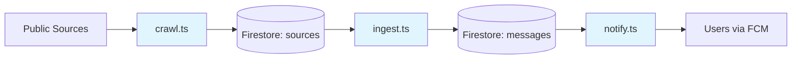

# Ingest Pipeline

Data collection and processing pipeline for OboApp. Collects infrastructure disruption notices from public sources (water, heating, road repairs) across Sofia, processes them into geocoded GeoJSON, and delivers notifications to interested users.

## Pipeline Overview



## Components

- **[crawlers/](crawlers/README.md)** - Automated scrapers that fetch raw data from external sources
- **[messageIngest/](messageIngest/README.md)** - Processing pipeline: AI extraction → geocoding → GeoJSON conversion
- **[notifications/](notifications/README.md)** - Geographic matching and push notification delivery

## Usage

```bash
# Run a specific crawler
npm run crawl -- --source rayon-oborishte-bg

# Process all sources into messages
npm run ingest

# Send notifications for new messages
npm run notify
```

## Deployment

Dockerized for Google Cloud Run Jobs. See `Dockerfile` and `terraform/` directory.
