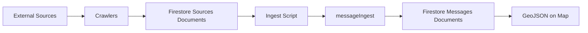

# Crawlers

Automated data collectors that fetch public notifications and disruptions from external sources, storing them as raw documents in Firestore.

## Available Crawlers

- **rayon-oborishte-bg** - Scrapes repair/disruption notices from Rayon Oborishte's website
- **mladost-bg** - Scrapes repair/disruption notices from Rayon Mladost's website
- **sofia-bg** - Scrapes municipal repair announcements and traffic changes from Sofia.bg
- **sofiyska-voda** - Fetches water supply disruptions from Sofiyska Voda's ArcGIS API
- **toplo-bg** - Fetches heating infrastructure incidents from Toplo.bg with pre-geocoded polygons
- **erm-zapad** - Fetches power outage incidents from ERM-Zapad for София-град municipalities

## How They Work

Each crawler:

1. Fetches raw data from its source (web scraping or API)
2. Extracts structured information (title, content, dates, URLs)
3. Stores documents in Firestore with `sourceType` identifier
4. Tracks processed URLs to avoid duplicates

## Running Crawlers

```bash
# Run a specific crawler
npx tsx crawl --source rayon-oborishte-bg
npx tsx crawl --source mladost-bg
npx tsx crawl --source sofiyska-voda
npx tsx crawl --source toplo-bg
npx tsx crawl --source sofia-bg
npx tsx crawl --source erm-zapad

# List available sources
npx tsx crawl --help
```

## Data Pipeline



After crawlers store raw documents in the `sources` collection, use the ingest script to process them:

```bash
# Process all sources within Oborishte boundaries
npx tsx ingest --boundaries messageIngest/boundaries/oborishte.geojson

# Process sources from a specific crawler
npx tsx ingest --source-name sofiyska-voda

# Dry run to preview
npx tsx ingest --dry-run --source-name rayon-oborishte-bg
```

The ingest script runs each source through the [messageIngest](../messageIngest) pipeline to extract addresses, geocode locations, and generate map-ready GeoJSON features.
