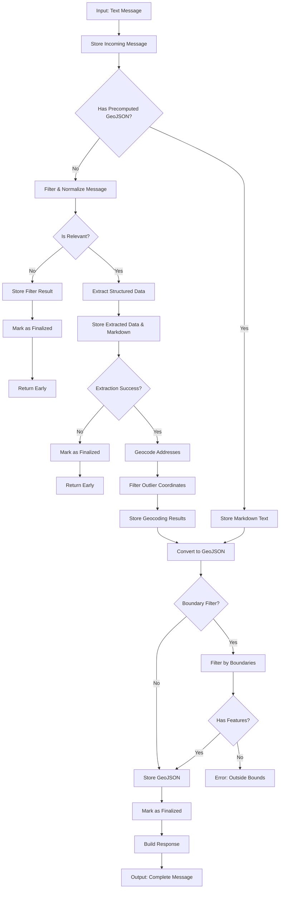

# Message Ingest Pipeline

This directory contains the message ingest pipeline that filters, extracts, geocodes, and generates GeoJSON data from messages about public infrastructure disruptions in Sofia, Bulgaria.

## Usage

```typescript
import { messageIngest } from "@/lib/messageIngest";

const message = await messageIngest(text, "web-interface", userId, userEmail);

// If you already have GeoJSON (e.g., from a crawler), provide it to skip filtering/AI/geocoding:
const precomputed = await fetchGeoJsonFromSource();
await messageIngest(text, "sofiyska-voda", userId, userEmail, {
  precomputedGeoJson: precomputed,
  markdownText: "formatted text",
});
```

## Pipeline Flow



## Pipeline Stages

### Filtering Stage (AI-powered)

- **Filter Message** - Determine if message is relevant to public infrastructure
- **Normalize Text** - Remove transport-only details (bus routes, metro schedules)
- **Store Filter Result** - Save filter decision and normalized text for debugging
- **Early Exit** - If irrelevant, finalize and skip geocoding

### Extraction Stage (AI-powered)

- **Extract Structured Data** - Parse locations, times, responsible entities from normalized text
- **Store Extracted Data** - Save pins, streets, timespans, and markdown formatting
- **Early Exit** - If extraction fails, finalize without GeoJSON

### Geocoding Stage

- **Geocode Addresses** - Convert addresses to coordinates (Google for pins, Overpass for streets)
- **Filter Outliers** - Remove coordinates >1km from others
- **Store Geocoding** - Save validated coordinates

### GeoJSON Stage

- **Convert to GeoJSON** - Create Point/LineString/Polygon features
- **Boundary Filtering** - Optional geographic bounds check
- **Store GeoJSON** - Save final geometry
- **Finalize** - Mark message as complete

### Precomputed GeoJSON Path

- Crawlers with ready GeoJSON (sofiyska-voda, toplo-bg, erm-zapad) skip filtering and extraction
- Markdown text stored directly if provided
- Proceed to boundary filtering and finalization
