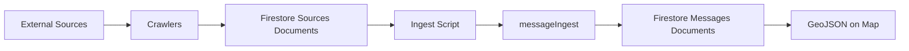

# Crawlers

Automated data collectors that fetch public notifications and disruptions from external sources, storing them as raw documents in Firestore.

## Available Crawlers

- **rayon-oborishte-bg** - Scrapes repair/disruption notices from Rayon Oborishte's website
- **sofiyska-voda** - Fetches water supply disruptions from Sofiyska Voda's ArcGIS API

## How They Work

Each crawler:

1. Fetches raw data from its source (web scraping or API)
2. Extracts structured information (title, content, dates, URLs)
3. Stores documents in Firestore with `sourceType` identifier
4. Tracks processed URLs to avoid duplicates

## Running Crawlers

```bash
npm run crawl:rayon-oborishte
npm run crawl:sofiyska-voda -- --dry-run  # preview mode
```

## Data Pipeline



After crawlers store raw documents in the `sources` collection, use the [ingest script](../INGESTION.md) to process them:

```bash
# Process all sources within Oborishte boundaries
npm run ingest -- --boundaries=lib/messageIngest/boundaries/oborishte.geojson

# Process sources from a specific crawler
npm run ingest -- --source-type=sofiyska-voda --boundaries=lib/messageIngest/boundaries/oborishte.geojson
```

The ingest script runs each source through the [messageIngest](../messageIngest) pipeline to extract addresses, geocode locations, and generate map-ready GeoJSON features.
